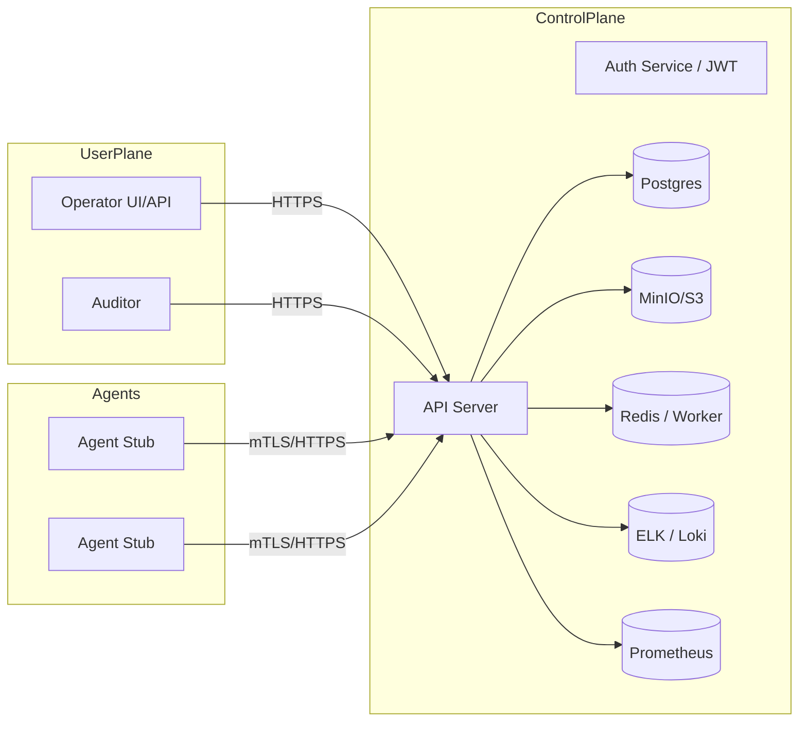

# Architecture — Custom C2 Simulator (Overview)

## 1. Các component chính
- **API Server (Backend)**  
  - Framework: FastAPI (Python) / hoặc Go / hoặc Node — cung cấp REST API cho agents & operators.
  - Chức năng: auth, agents management, tasks management, file proxy, audit logging.

- **Database**  
  - PostgreSQL: lưu users, agents, tasks, heartbeats, audit_logs.

- **Object Storage**  
  - MinIO (S3-compatible) cho dev; AWS S3 / GCS cho production.

- **Agent-stub (Client)**  
  - Chạy trên lab VM/container; chức năng: register, heartbeat, upload/download mẫu.

- **Queue / Background worker**  
  - Redis + RQ / Celery (nếu cần xử lý bất đồng bộ: file processing, cleanup).

- **UI (Optional)**  
  - React/Vue minimal dashboard cho operators.

- **Observability**  
  - Prometheus (metrics), Grafana (dashboards), Loki / ELK cho logs.

- **Ingress / Load Balancer**  
  - nginx/Traefik Ingress; rate limiting, TLS termination (mTLS optional).

- **Secrets Management**  
  - HashiCorp Vault hoặc k8s Secrets (encrypted at rest).

## 2. Luồng tương tác chính (sequence)
1. Agent -> POST `/api/v1/agents/register` (TLS)
2. Server -> trả `agent_id`, config (poll interval)
3. Agent -> POST `/api/v1/agents/{id}/heartbeat` (status)
4. Operator -> POST `/api/v1/tasks` (benign task)
5. Agent -> GET `/api/v1/agents/{id}/tasks` (reads task descriptor)
6. Agent -> PUT `/api/v1/agents/{id}/upload` (upload report file)
7. Operator / Auditor -> GET `/api/v1/files/{id}` (download)

## 3. Diagram (Mermaid)

Chú thích: Diagram dùng để hiểu ranh giới. Mọi kết nối phải TLS. mTLS giữa Agent và API là tùy chọn nhưng khuyến nghị để mô phỏng strong auth.
## 4. Network & Security boundary notes
- API Server chỉ mở port 443 (TLS), management access qua VPN / bastion cho production.
- DB & MinIO chỉ доступable từ internal network (k8s cluster hoặc VPC).
- Apply Network Policies (k8s) để giới hạn traffic.
## 5. Deployment options (dev vs prod)
- Dev: Docker Compose (local), self-signed TLS, MinIO, Postgres.
- Prod-like: k8s (Helm), Vault, external LB, managed DB/storage.